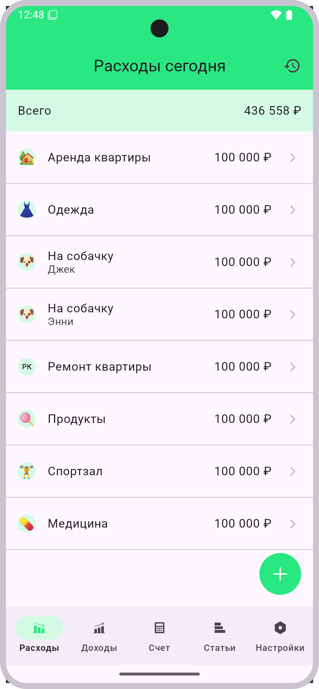
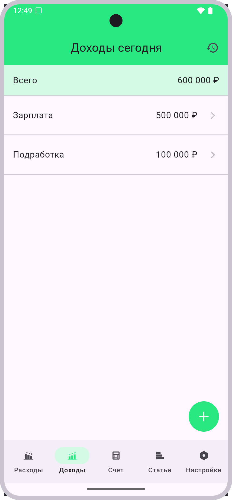
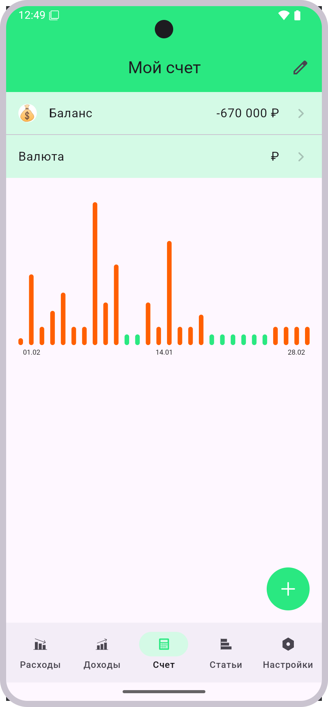
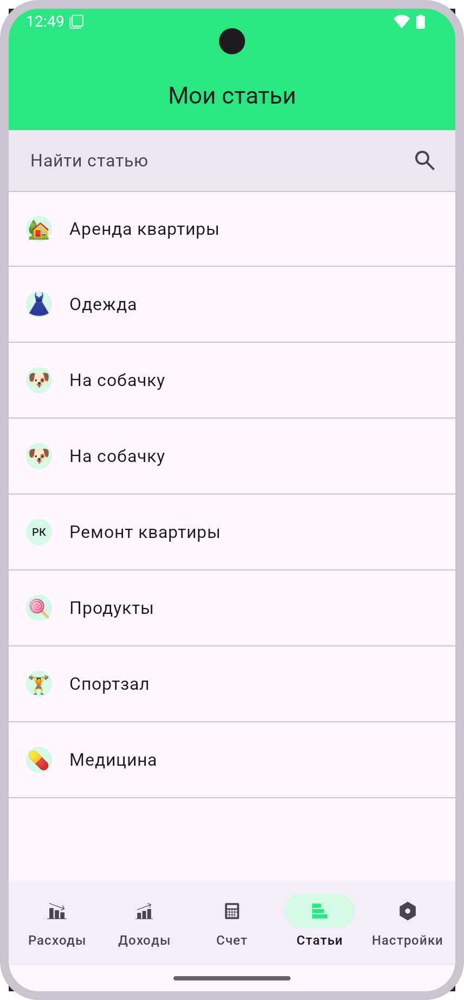
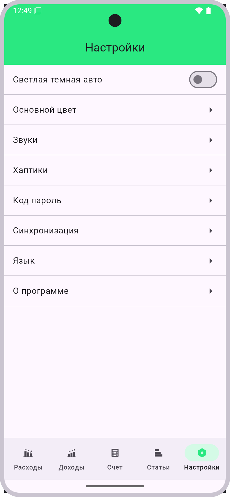

# Домашнее задание 1 — ШМР Android

## Структура проекта
Проект разбит на 5 модулей, каждый из которых отвечает за отдельную часть архитектуры приложения.

### 1. `:mock`
- Содержит mock-данные.

### 2. `:domain-model`
- Содержит **доменные модели** 
- На данный момент не используется

### 3. `:presentation-model`
- Содержит модели, готовые для отображения на экране.

### 4. `:ui`
- Содержит Jetpack Compose UI-компоненты.
- Реализует экраны

### 5. `:demo`
- Основной модуль, содержащий `Application` класс.
- Объединяет все модули.

## Папка raw

В папке `raw` находится тестовый **скин эмулятора**, соответствующий макету из Figma:
- **Диагональ:** 6.21 дюйма
- **Разрешение:** 824×1812 пикселей

Также содержит svg иконки приложения

## Скриншоты

### 📉 Экран «Расходы»

### 📈 Экран «Доходы»

### 🧾 Экран «Счет»

### 📊 Экран «Статьи»

### ⚙️ Экран «Настройки»
