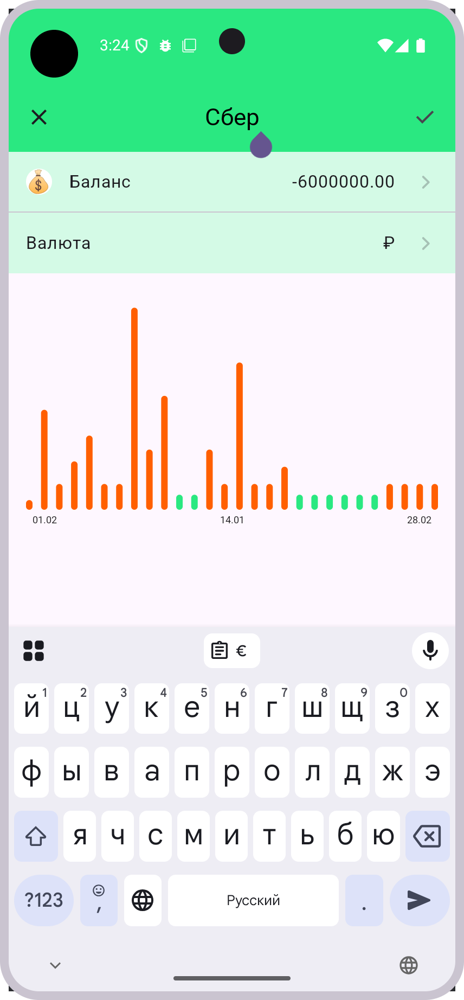
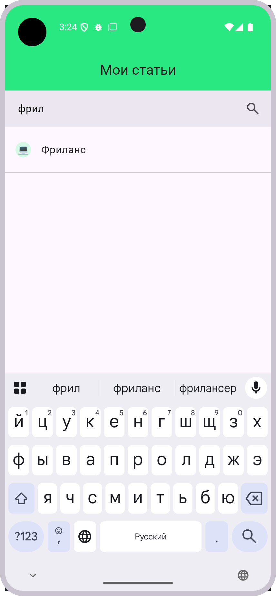

# Домашнее задание 4 — ШМР Android

## Структура проекта
Проект разбит на несколько модулей.

## App
### 1. `:app`
- Основной модуль
- Реализует навигацию и объединяет фичи вместе
- Реализует логику BottomBar-a и TAB-а, т.к. они присутствуют на всех экранах. Реализация экранов переложена на фичи.
- **Новое**: Управляет состоянием BottomSheet и режимом редактирования TopAppBar

### 2. `:demo`
- Экраны на моковых данных с 1 домашки
- Реализует навигацию и объединяет фичи вместе

## Core
### 1. `:data`
- Содержит интерфейсы репозиториев. Реализации скрыты (internal) и внедряются через DI.
- Реализует получение времени, мониторинг подключения к интернету и активного счёта для запросов.
- Активный счёт используется моковый, с заданным id = 54. При тестировании можно заменить

### 2. `:datastore`
- На данный момент не используется

### 3. `:domain`
- Содержит юз-кейсы фич.
- **Изменено**: Перенесены некоторые UseCase'ы в соответствующие feature модули

### 4. `:mock`
- Моковые данные для экранов demo. 

### 5. `:model`
- Доменные модели для передачи информации между слоями (data-domain-presentation) и модулями
- **Новое**: Добавлены extension функции для AccountDetailed

### 6. `:network`
- Реализует все запросы в сеть.
- Содержит публичный интерфейс со всеми доступными запросами. Реализация скрыта и внедряется через DI
- Есть несколько инструментальных Unit-тестов
- **Новое**: Поддержка PUT запросов для обновления аккаунтов

### 7. `:presentation:model`
Содержит:
- Модели для UI
- Ресурсы приложения
- Мапперы из доменных моделей для валюты, доменных ошибок, эмодзи и денежных единиц
- **Новое**: Расширенный CurrencyMapper, EmojiMapper, улучшенная модель CurrencyData

### 8. `:presentation:ui`
Содержит:
- Базовые компоненты UI.
- Темы, цвета, типографию
- **Новое**: EditableTopAppBar, DatePickerDialog, утилиты для scrim эффектов

## Feature
Реализуют конкретные экраны, вложенную навигацию (где применимо).
Используют юз-кейсы

### **Новые возможности в фичах:**

#### Account

- **Редактирование названия аккаунта** через EditableTopAppBar
- **Выбор валюты** через BottomSheet

#### Categories

- **Полнофункциональный экран** с ViewModel и состояниями
- **Поиск по категориям** с фильтрацией в реальном времени

#### **Новый модуль: bottomsheet**

- **BottomSheet для выбора валюты**
- **Drag-to-dismiss функциональность**

## Запуск
Для запуска проекта нужно создать файл secrets.default.properties в корневой папке проекта и задать значения:
- BEARER_TOKEN
- BACKEND_URL
###

Также для тестирования экранов расходы/доходы/история можно изменить активный accountId в mock-данных
###

## Скриншоты

### 📱 Новые возможности

#### 📝 Редактирование названия аккаунта

#### 💰 Выбор валюты через BottomSheet

#### 🔍 Поиск по категориям

