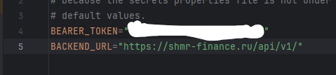
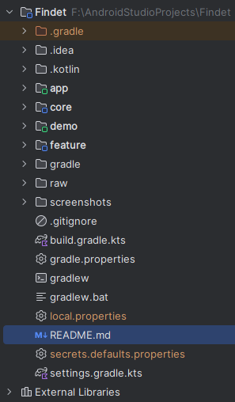
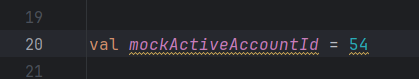
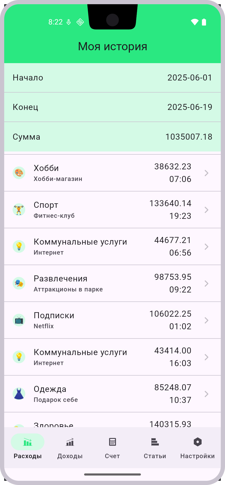
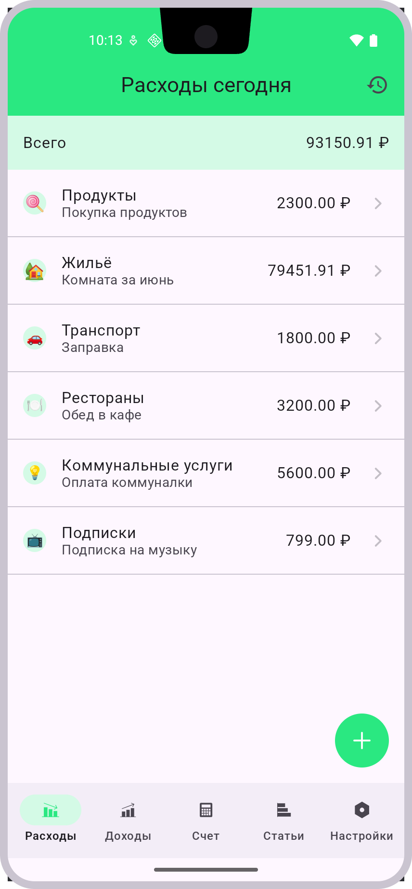

# Домашнее задание 2 — ШМР Android

## Структура проекта
Проект разбит на несколько модулей. Новые модули:

### 1. `:data`
- Содержит репозитории. На данный момент реализации - запросы в сеть без кеширования
- Реализует также получение времени и активного счёта для запросов
- Активный счёт пока что - мок

### 2. `:domain`
- Содержит юз-кейсы фич

### 3. `:datastore`
- На данный момент не используется

### 4. `:network`
- Реализует все запросы в сеть
- По хорошему инкапсулировать сетевые ошибки здесь - на следующей неделе отрефачу

### 5. `:app`
- Реализует навигацию и объединяет фичи вместе

### 5. `:feature`
- Основной модуль, содержащий `Application` класс.
- Объединяет все модули.

## Запуск
Для запуска проекта нужно создать файл secrets.default.properties в корневой папке проекта и задать значения:
- BEARER_TOKEN
- BACKEND_URL
###

Также для корректной работы экранов расходы/доходы/история нужно изменить активный accountId в mock-данных
###

Помимо этого в network/androidTest есть тест с помощью которой можно нагенерировать различные транзакции за последний месяц. 
Её удобно использовать для тестирования

## Скриншоты

### 📉 Экран «История»

### 📈 Экран «Доходы»

### 🧾 Экран «Расходы»
